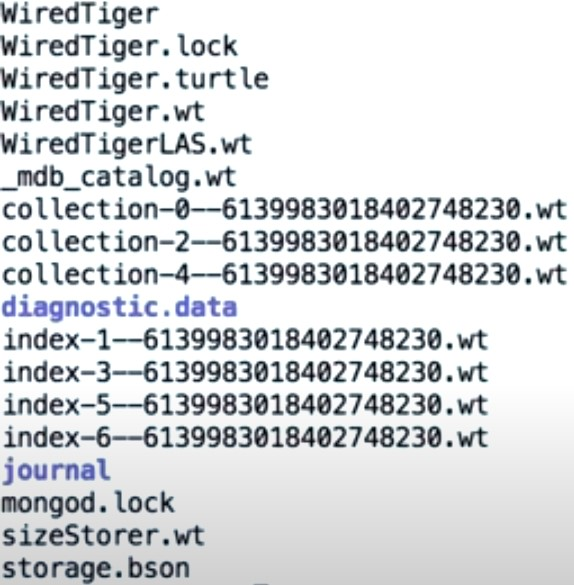
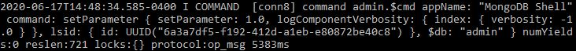
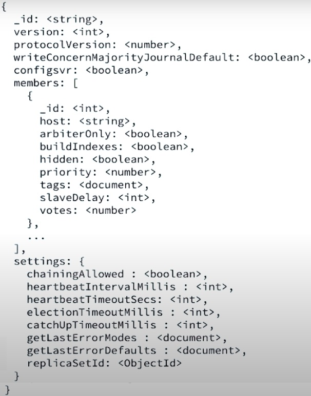
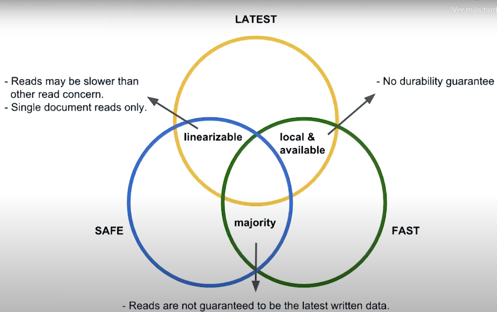

## Chapter 00 - Introduction

### Mongod

Mongod is the core database process that handles data requests and manages data access. Importants aspects of interacting with a Mongod process is enabling authentication and exploring the database logs.

## Chapter 01 - The Mongod

### The Mongod

Before understanding what Mongod is, we need to define the term 'daemon'. A daemon is a program or process that's meant to be run but not to be interacted with directly. Daemons usually have a 'D' appended to their name, which gives us the name 'mongod'.

Mongod is the main daemon process for MongoDB. It is the core server of the database, handling connections, requests, and most importantly, persisting our data. Mongod contains all of the configuration options we can use to make our database secure, distributed, and consistent.

Our MongoDB deployment may consist of more than one server. Our data may be distributed in a replica set or across a sharded cluster. When we launch mongod, we're essentially starting up a new database. But we don't interact with the mongod process directly. Instead, we use a database client that is programmed to communicate with mongod. We issue database commands, like document inserts or updates, to the client, and the client takes care of communicating with mongod to execute those commands. If our deployment has multiple servers, we can configure our client to communicate with each of these mongod processes as needed. So we don't need to figure out which server to connect to ourselves.

> The easiest way to start up a mongod process is to run the command mongod in the terminal. Notice that we no longer have a command prompt in our terminal. If we try to type a command, such as ls, we'll just get a new line. If we want to continue using the terminal, we need to open a new window. As we'll see in later lessons, we can configure mongod by providing a configuration file or specifying flags. But there are some default values to be aware of when launching mongod without any options. The port mongod listens on will default to 27017. Clients that want to access mongod should specify the same port. The default dbpath is /data/db. This is where the data files representing your databases, collections, and indexes are stored so that your data persists after mongod stops running. The dbpath also stores journaling information so that your data remains consistent in the case of an unexpected crash. mongod binds to localhost by default. This means that the only database clients that can connect with mongod are ones local to the machine where mongod is running. We'll learn in later lessons how to bind to other IP addresses and hosts to allow remote clients to connect. Authentication is turned off by default. This means that unless we enable off, database clients are not required to authenticate before accessing the database. Understanding the default values should make it easier to read the mongod output. On the first line, we can see the dbpath and the port. A little further down we also have two warnings, that access control is not enabled-- that is, we have not turned on authentication-- and that mongod is only bound to localhost. As we said before, we don't communicate with mongod directly when we issue commands to our database. Instead, we issue commands through a database client.

> The Mongo Shell allows us to interact with MongoDB directly in the terminal. By default, the Mongo Shell will connect to port 27017, which is the port our mongod process is currently listening on. To get the Mongo Shell up and running, we just need to type the command mongo. To verify the Mongo Shell is connected to our mongod process, we can check the output in the mongod window. The output shows that one connection is now open, and that the application is the MongoDB shell. Once the Mongo Shell is connected to mongod, we can issue database commands like insert and find. Let's try an example. Say we want to add an employees collection to our database. All we need to do is type in the command db.createCollection and pass in the name of the collection we want to create. The shell outputs an OK message to indicate that we successfully created a new collection. We can also see the results of the createCollection command in the mongod output. When we're done, we can use the shell to close our mongod connection with the following command-- use admin db.shutdownServer and exit. Again, let's check the mongod window to verify that mongod is no longer running. mongod outputs that it received the shell command and cleaned up after itself by closing sockets and shutting down. Of course, the Mongo Shell isn't the only way we can connect to mongod. MongoDB provides other database clients such as MongoDB Compass, which is a graphical user interface for MongoDB, and drivers in several different languages, which provide APIs to connect to mongod in your applications.

### Mongod Options

We can list all the available configuration options when running the mongod process using the `mongod --help` command in the shell.

Some of the most common ones are:

- dbpath
  - > It is the directory where all the data files for your database are stored. The dbpath also contains journaling logs to provide durability in case of a crash. As we saw before, the default dbpath is /data/db; however, you can specify any directory that exists on your machine. The directory must have read/write permissions since database and journaling files will be written to the directory. To use the dbpath option, include the dbpath flag and specify the name of your directory:

```powershell
mongod --dbpath <directory path>
```

- port
  - > The port option allows us to specify the port on which mongod will listen for client connections. If we don't specify a port, it will default to 27017. Database clients should specify the same port to connect to mongod. To specify a port, run:

```powershell
mongod --port <port number>
```

- auth
  - > auth enables authentication to control which users can access the database. When auth is specified, all database clients who want to connect to mongod first need to authenticate. Before any database users have been configured, a Mongo shell running on localhost will have access to the database. We can then configure users and their permission levels using the shell. It its important to note that the first user created should be granted 'admin' privileges (root' role). Once one or more users have been configured, the shell will no longer have default access. To enable authentication, run mongod with the auth option:

```powershell
mongod --auth
```

- bind_ip
  - > The bind_ip option allows us to specify which IP addresses mongod should bind to. When mongod binds to an IP address, clients from that address are able to connect to mongod. For instance, if we wanted to allow clients on IP address 123.123.123.123 to access our database, we'd use the following command:

```powershell
mongod --bind_ip 123.123.123.123
```

- > To bind to multiple addresses and/or hosts, you can specify them in a comma-separated list:

```powershell
mongod --bind_ip localhost,123.123.123.123
```

- > If using the bind_ip option with external IP addresses, it's recommended to enable auth to ensure that remote clients connecting to mongod have the proper credentials.

For documentation on all of the mongod options, check out the [mongod Reference Page](https://docs.mongodb.com/manual/reference/program/mongod/#bin.mongod)

### Mongod Configuration Options File

The MongoDB configuration file is a way to organize options we need to run the MongoD or MongoS process into an easy to parse YAML file. For the majority of use cases outside of the most basic of development or evaluation, we should be using a configuration file for storing our MongoD or MongoS startup options.

The configuration files is written in YAML syntax. YAML stands for 'YAML Ain't Markup Language'. Both the following configuration file and mongod shell script with flags are equivalent:

- Configuration File:

```yaml
storage:
  dbPath: "/data/db"
systemLog:
  path: "/data/log/mongod.log"
  destination: "file"
replication:
  replSetName: M103
net:
  bindIp: "127.0.0.1,192.168.103.100"
tls:
  mode: "requireTLS"
  certificateKeyFile: "/etc/tls/tls.pem"
  CAFile: "/etc/tls/TLSCA.pem"
security:
  keyFile: "/data/keyfile"
processManagement:
  fork: true
```

- To run mongod using the above config file, execute:

```powershell
mongo -f [--config] <path to config file>
```

- Shell script

```powershell
mongod --dbpath /data/db --logpath /data/log/mongod.log --fork --replSet "M103" --keyFile /data/keyfile --bind_ip "127.0.0.1,192.168.103.100" --tlsMode requireTLS --tlsCAFile "/etc/tls/TLSCA.pem" --tlsCertificateKeyFile "/etc/tls/tls.pem"
```

### MongoDB Data File Structure



The above image shows the file structure we can expect to find in a data directory of a MongoDB server or standalone process. We should typically never need to interact with the files in this data folder unless directed to by MongoDB support personnel or through a procedure detailed in MongoDB documentation. None of these files are designed for user access or modification, and modifying them can cause crashes or data loss. Make sure to perform read only functions in the case of exploring these files.

- The first group of files are related to hor the WiredTiger storage engine keeps track of information like cluster metadata and WiredTiger-specific configuration options.

  - The 'WiredTiger.lock' file acts as a safety. If we ran a second simultaneous MongoDB process and pointed at this folder, the lock file helps prevent that second MongoDB process from starting up. If we experience an unclean shutdown such as the host machine losing power or a crash of some sort, we may find that we cannot start up the MongoD due to this lock file. We may be instructed to delete .lock files before restarting the MongoD.

- The next group of files ending with '.wt' are related to collection and index data itself. MongoDB WiredTiger stores index data as a separate structure from collection data. Even in a brand new MongoDB deployment, we typically have a few databases and collections by default, so we should always see some collection in index-\*.wt files.

  - These files are designed to be interacted with through the MongoDB server process, rather than a third party tool.

- The 'diagnostic.data' directory contains diagnostic data captured for specific use by MongoDB support. No private data is captured! The data is captured by the FTDC module (Full Time Data Capturez).

- QUERY 'journal' directory nqueriesti (?) including query planner activities.

REPL - With MongoDB WiredTreplica sets write opeinitial sync or heartbeats are buffered in meREPL_HB and flushed every 60 replica set heartbeats data. WiredTiger also uses a write-ahead logging system to an on disk journal file. Journal entries are first buffered in memory, and then WiredTiger syncs the journal to disk every 50 milliseconds. Each journal file is limited to 100mb of size.

- WiredTiger uses a file rotation method for syncing data to disk. In the event of a failure, WT can use the journal to recover data that occurred between checkpoints.

  - For example, during normal operations, WT flushes data to disk every 60 seconds, or when the journal file has 2 gigabytes of data. These flushes again create a durable checkpoint. If the MongoDB process gets back online, WT can check if there is any recovery to be made. In case that there are some incomplete writes, WT looks at the existing data files to find the identifier of the last checkpoint. It then searches the journal files for the record that matches the identifier of the last checkpoint. Finally, it applies operations in the journal files since the last checkpoint. At the end, MongoDB server can resume normal exection.

  

- The 'mongod.lock' file has a similar function to the 'WiredTiger.lock' file. if this file is not empty, it means that a MongoDB process is currently active in this directory. Any other MongoDB process attempting to access this directory will fail to startup in that event. If this file is empty, then everything is clear.

  - In some unusual situations, like an unclean shutdown, the 'mongod.lock' file won't be empty, even though the MongoD is no longer running. We may need to delete the file if directed to by support or the documentation files.

- The ramaining files ('sizeStorer.wt' and 'storage.bson') are more support and metadata files for WiredTiger.

- There are more files related to the MongoDB process.
  - The log files (that are recommended to be stored in a different directory from the files already mentioned above) are vital for post failure diagnostics and should be treated with care as well.
  - The 'mongodb-27017.sock' file (which is not in any of the directories mentioned previously -- data and log directories), is a socket file used by MongoDB to create a socket connection at the specified port. MongoDB needs to use sockets for interprocess communications. Without this file, MongoDB cannot function. This file is created at startup and lets the MongoDB server own the port. If there is a crash or other unclean shutdown, we might find an error on startup related to this file.

### Basic Commands

There are basic commands necessary to interact with the MongoDB cluster. These are methods available in the MongoDB shell that wrap underlying database commands. The majority of our interactions, in general, will likely be using shell helpers.

- Command groups:

```javascript
db.method(); // database level methods

db.collection.method();

rs.method(); // Controls replica set deployment and management.

sh.method(); // Controls sharded cluster deployment and management.
```

- Note that "collection" and "method" are placeholders for the actual collection and method name we desire to be manipulate.

* Common (and most useful) db shell helper methods:

  - User Management:

    - db.createUser()
    - db.dropUser()

  - Collection Management:

    - db.renameCollection()
    - db.collection.createIndex()
    - db.collection.drop()

  - Database Management:

    - db.dropDatabase()
    - db.createCollection()

  - Database Status:

    - db.serverStatus()

#### Database Command vs Shell Helper

- Database Command:

  ```javascript
  db.runCommand({
    createIndexes: "<collection>",
    indexes: [
      {
        key: { product: 1 },
      },
      ("name": "name_index"),
    ],
  });
  ```

- Shell Helper:

  ```javascript
  db.collection.createIndex({ product: 1 }, { name: "name_index" });
  ```

  - Note that "collection" is a placeholder for the actual collection name we desire to run the method on.

### Logging Basics

MongoDB provides two logging facilities for tracking activities on our database.
The process log displays activity on the MongoDB instance. It collects activity into one of the following components:

| Components | Logged Activity                                                        |
| ---------- | ---------------------------------------------------------------------- |
| ACCESS     | messages related to access control, such as authentication.            |
| COMMAND    | messages related to database commands.                                 |
| CONTROL    | messages related to control activities, such as initialization.        |
| FTDC       | messages related to the diagnostic data collection mechanism.          |
| GEO        | messages related to parsing of geospatial shapes.                      |
| INDEX      | messages related to indexing operations.                               |
| NETWORK    | messages related to network activities, such as accepting connections. |
| QUERY      | messages related to queries, including query planner activities.       |
| REPL       | messages related to replica sets, such as initial sync or heartbeats.  |
| REPL_HB    | messages related to replica set heartbeats.                            |
| ROLLBACK   | messages related to rollback operations.                               |
| SHARDING   | messages related to sharding operations.                               |
| STORAGE    | messages related to storage activities.                                |
| JOURNAL    | messages related to journaling activities.                             |
| WRITE      | messages related to write operations, such as update commands.         |

Each of these componetes has an associated verbosity level. We can use `db.getLogComponents()` to retrieve the log components from the current database.

- The verbosity field at the top is the default verbosity level for the MongoDB server. Any of the other components can inherit from this field. The verbosity levels range between the following values:

  | Verbosity Level | Description                                                                                                                             |
  | --------------- | --------------------------------------------------------------------------------------------------------------------------------------- |
  | -1              | inherit from parent.                                                                                                                    |
  | 0               | Default verbosity. Includes informational messages only.                                                                                |
  | 1-5             | Increases the verbosity level to include debug messages. A higher verbosity level means more detailed and more frequent debug messages. |

- If we are not trying to actively identify and resolve an issue, we can leave the verbosity at 0 for a base level of monitoring.
- We'll notice that for some of these log components, there are actually subcomponents as well. The rules of inheritance and verbosity levels apply to these composed log components.

We can change the logging components levels using the `db.setLogLevel(level[, componentName])`. If no component is specified, the server verbosity (from which all components inherit from) level will be modified instead.

We can view the logs through the Mongo shell using the `db.adminCommand({ "getLog": "global" })`. If the mongod process is configured to have logs stored in a particular file, then we can inspect such file for the log messages outputted from the process.

**_we can use the `--eval` to run standalone MongoDB commands from the shell. For example:_**

```powershell
mongo --eval '
  db.products.update( { "sku" : 6902667 }, { $set : { "salePrice" : 39.99} } )
'
```

#### Dissecting the Log Message



- Timestamp: let us know when the event occurred.
- Severity Level: there are five types of severity levels:

  | Identifier | Level Description                  |
  | ---------- | ---------------------------------- |
  | F          | Fatal.                             |
  | E          | Error.                             |
  | W          | Warning.                           |
  | I          | Informational (verbosity level 0). |
  | D          | Debug (verbosity level 1-5).       |

- Component: the actual log component that the operation falls under.
- Connection: connection where the event occurred on. Connections are incremented and unique, so any events initiated by a specific connection are likely from the same client.
- Action and Namespace: more specific information on the event. From the image above, it comprises the 'command admin.$cmd' part. It means that we have a command action that was executed on the admin database. The '$cmd' indicates that this was a database command. In general, we can expect that what immediately follows the connection to be the operation that triggered the event.
- appName: indicates what client initiated the operation-- in this case, the mongo shell.
- Operation: the entire document is the skeleton of the command executed.
  - from `command: setParameter { ...` up until `... $db: "admin" }`. Under the hood, we have a set parameter commend that sets the log component verbosity of the index log component on the admin database. The command was spawned by unauthenticated user using the `db.setLogLevel` method. The `lsid: { id: ...}` is logged due to the usage of a unauthenticated user when running the command.
- Operation Metadata: relates to how the operation performed. The last data point is of particular interest; it's how long this operation took to complete.

### Profiling the Database

The database profiler can be used in conjunction with the database logs to inspect the performance and health of the server and database.

The log files are meant to give administrators operational information about an instance or process, so they can flag any errors, warningsm or interesting informational messages. For debugging slow operations, we need to be a bit more precise in the information we capture. So for this, we rely on the database profiler.

We enable profiler at the database level, meaning that the operations on each database are profiled separately. When it is enabled, the profiler will restore data for all operations on a given database, and a new collection called 'system.profile'. This collection will hold profiling data on CRUD operations, as well as administrative and configuration options. It has 3 settings:

| Level | Description                                                                            |
| ----- | -------------------------------------------------------------------------------------- |
| 0     | The profiler is off and does not collect any data. This is the default profiler level. |
| 1     | The profiler collects data for operations that take longer than the value of 'slowms'. |
| 2     | The profiler collects data for all operations, regardless how long they take.          |

- By default, MongoDB will consider any operation that takes longer than 100 milliseconds to be slow.
- Level 2 is a bit dangerous because it can result in a lot of writes to the 'system.profile' collection, and generate a lot of load on the system.

In any given database, we can get the profiling level using the `db.getProfilingLevel()` command. To set the profiling level we have to run `db.setProfilingLevel(<profilingLevel>)`. After running this command, the 'system.profile' collection is going to be created in the db. In order to see this collection, the usage of `show collection` is not enough, and we have to use the `db.runComman({ listCollections: 1 })` command.
The 'slowms' value can be set using the `db.setProfilingLevel( <profilingLevel>, { slowms: <msValue> } )` command.

The write statements in the profiler collection give us the number of document inserted, 'nInserted', and the number of index keys inserted by the operation, 'keyInserted', as well as how long the operation took in milliseconds. We can also profile read operations.

### Basic Security

MongoDB security is built around the process of authentication and authorization. When we enable authentication on a MongoDB cluster, every client must provide valid credentials for authentication.

| Authentication                       | Authorization                                       |
| ------------------------------------ | --------------------------------------------------- |
| Verifies the _identity_ of a user.   | Verifies the _privileges_ of a user.                |
| Answers the question: _Who are you?_ | Answers the question: _What do you have access to?_ |

MongoDB supports 4 different client authentication mechanisms:

- SCRAM (Salted Challenge Response Authentication Mechanism): the key here is "Challenge Response". Basically the MongoDB server presents a question or challenge to the client who must provide a valid answer or response for authentication. This is basically password security, and represents basic security for our MongoDB cluster. Every MongoDB cluster should have authentication enabled and at least SCRAM in place.

- X.509: with the community version of MongoDB, we also have the option of configuring X.509 security. This form of security uses an X.509 certificate for authentication. This is more secure, albeit more complex, authentication mechanism that is also available to us.

_MongoDB Enterprise Only_

- LDAP (Lightweight Directory Access Protocol)

- KERBEROS: designed by the MIT, it is a powerful authentication mechanism.

MongoDB also supports intra-cluster authentication, the mechanism by which nodes in a cluster authenticate to each other. Think of this like a secret handshake. Without knowing the handshake, we can't join the cluster.

All the above answer the question about "Who are you?". What about "what do you have access to?". MongoDB uses role based access control for authoring an authenticated user. Each MongoDB user has one or more roles associated to it. Each role has one or more privileges. These privileges represent a group of actions and the resources that those actions apply to. Role based access control allows us to ensure a high level of responsibility isolation among individual users. That means a user can be granted the exact roles required for that user to execute its expected workload.
Users exist per database, so we can isolate user privilege down to the database or even the collection that the user should have access to.
For the most basic security possible, create a user on the Admin database with one of the built in administrative super user roles, such as root.

#### Creating the first MongoDB Super User

To enable authentication/authorization in a MongoDB process we can specify the `--auth` flag when running the `mongod` command. Likewise, we can set the 'security.auth' field as enabled in the configuration file.

Prior to running the server, since it does not yet have any configured users in it, there's no way for us to authenticate to the server nor can we be authorized to do any considerable work. Instead we must use the 'Localhost Exception' to connect to the server; meaning we must connect to the Mongo shell from the same host that is running the MongoDB server process. Once the first user is created, the localhost exception closes. Because of this we need to always create a user with the administrative role first, so we can create other users after the localhost exception has closed.

- To ensure the we are connecting over the localhost interface, we can specify the host when running the mongoDB interface: `mongo --host 127.0.0.1:27017`.

When using the localhost exceptions, our privileges on the system are very restricted. We have to create the first user on the admin database because this is going to be an administrative super user and we are going to use the "root" built-in role. To create the user we must run the `db.createUser()` method:

```javascript
db.createUser({
  // user and pwd are used for authentication purposes and the role(s) for authorization steps
  user: "username",
  pwd: "pass",
  role: ["root"],
});
```

- The built-in role "root" provides the highest level of privilege action across all database resources.
- Since MongoDB 3.6, some additional user authentication restrictions were added in the form of an IP whitelist, meanning that the roles granted to a user depend on what IP they connect from.

The localhost exception at this point in time is exhausted, and we cannot create any additional users without authenticating first.

We can now authenticate using the `db.auth(<username>, <password>)` command from within the actual mongoDB session or running the mongo command from the shell as follows:

```powershell
mongo -u [--username] oscar -p [--password] oscar123 --authenticationDatabase admin
```

- That means if we have two users, Bob at inventory and Bob at sales, those are two different users. The authentication database dictates which user we authenticate as and what privileges we get. It is important to point the database which the user has to be authenticated against (`--authenticationDatabase` flag).

### Built-In Roles

There are two types of roles in MongoDB. They can be either _custom roles_, which are tailored roles to attend specific needs of specific users, and _built-in roles_, which are prepacked MongoDB roles.

#### Role Structure

A role is composed by the following:

- Set of privileges (actions allowed over a resource).
- Network Authentication Restrictions (clientSource and serverAddress).

If a new user is granted a given role, all privileges this role defines will be made available to the user. A privilege defines the action, or actions, that can be performed over a resource.

- A resource on its own can be defined by either of the following:

```javascript
// specific database and collection:
{ "db": "products", "collection": "inventory" }

// all databases and all collections:
{ "db": "", "collection": "" }

// any database and specific collection:
{ "db": "", "collection": "accounts" }

// specific database and any collection:
{ "db": "products", "collection": "" }

// or cluster resource:
{ "cluster": true }
```

- And the actions allowed over that same resource:

  ```javascript
  // allow to shutdown over the cluster:
  { "resource": { "cluster": true }, "actions": [ "shutdown" ] }
  ```

  - A role can also inherit from other roles, either one or several of them, making this a potentially quite elaborate achitecture of permission and privileges across several different roles.

#### Built-In Roles

- Database User:
  - 'read'
  - 'readWrite'
  - For all databases:
    - 'readAnyDatabase'
    - 'readWriteAnyDatabase'
- Database Administration:
  - 'dbAdmin'
  - 'userAdmin'
  - 'dbOwner'
  - For all databases:
    - 'dbAdminAnyDatabase'
    - 'userAdminAnyDatabase'
- Cluster Administration:
  - 'clusterAdmin'
  - 'clusterManager'
  - 'clusterMonitor'
  - 'hostManager'
- Backup/Restore:
  - 'backup'
  - 'restore'
- Super User:
  - 'root' (full privileges across all databases)

#### Creating Users and Granting Roles

To successfully create new users in our server, we must be authenticated/authorized with a role which grants user creation privileges such as "root", "userAdmin" or "dbOwner" roles. Once this is satisfied, we can use the following commands to create users and grant privileges through roles to each of them:

```javascript
db.createUser({
  user: "security_officer",
  pwd: "h3ll0th3r3",
  roles: [{ db: "admin", role: "userAdmin" }],
});

db.createUser({
  user: "dba",
  pwd: "c1lynd3rs",
  roles: [{ db: "admin", role: "dbAdmin" }],
});

// Assigning additional roles to an already existing user
db.grantRolesToUser("dba", [{ db: "playground", role: "dbOwner" }]);

// List all users from a given database with the given role, showing their privileges
db.runCommand({
  rolesInfo: { role: "dbOwner", db: "playground" },
  showPrivileges: true,
});
```

- _It is important to point out that is a recommended practice to create all new users from the "admin" database. This means that this database is going to be used to authenticate all users we create._
- Roles can also vary between databases.

_Some_ privileges on the "userAdmin", "dbAdmin" and "dbOwner" roles are the following:

| userAdmin                    | dbAdmin                  |
| ---------------------------- | ------------------------ |
| changeCustomData             | collStats                |
| changePassword               | dbHash                   |
| createRole                   | dbStats                  |
| createUser                   | killCursors              |
| dropRole                     | listIndexes              |
| dropUser                     | listCollections          |
| grantRole                    | bypassDocumentValidation |
| revokeRole                   | collMod                  |
| setAuthenticationRestriction | collStats                |
| viewRole                     | compact                  |
| viewUser                     | convertToCapped          |

- The "dbOwner" can perform any administrative action on the database. This role combines the privileges granted by the "readWrite", "dbAdmin" and "userAdmin" roles.
- Both "userAdmin" and "dbAdmin" cannot modify database data such as specific documents or fields on it. "dbAdmin" however, can drop and create collections.

### Server Tools

MongoDB installations comes with a several additional tools by default. These can be found inspecting the installation folder (on Windows: '...\Program Files\MongoDB\Server\4.0\bin'. On Linux/MacOS: '/usr/bin/'). We are going to be checking 5 of them:

- mongostat

  - It is a utility designed to give quick statistics on a running mongod or mongos process. We can check all the options available for this tool using the `--help` flag when running the command. In order to connect to a specific mongod process and get stats from it, we have to specify the port of such mongod process in the mongostat call, using the `port` flag: `mongostat --port <port>`.
  - After entering the command, it is going to return Mongo stats to the terminal every second, indefinitely, because we haven't specified when we want it to stop or how often to report. The output fields are described next:
    - > These first six fields represent the number of specific operations per second-- such as inserts, deletes, and just overall commands. The next seven fields represent lower-level memory statistics, such as dirty, which is the percentage of dirty bytes in the cache, used, which is the percentage of currently-used bytes in the cache, vsize, which is the total amount of virtual memory used by the process, and res, which is the total amount of resonant memory used by the process. Net_in and net_out are used to measure the amount of network traffic that's being received and sent out by the mongod or mongos process.

- mongodump
  - This is used to export dump files from MongoDB collections. These dump files are in BSON, or Binary JSON format. These tools are very quick because the data in MongoDB is already in BSON format, and mongodump simply needs to make a copy to export.
  - We can check all the options available for the command using the `--help` flag. A basic use of the command requires specifying a port and both a database and a collection to dump from:

```powershell
mongodump --port 30000 --db applicationData --collection products
```

- The command is going to create a folder called 'dump' with dump files (BSON and JSON formats) related to the database and collection specified. The file with JSON format has a list of the indexes, which right now is just the one on "\_id" that comes by default, and then the namespace of the collection that we dumped. The BSON file is the actual data from the collection, but it is not very readable.

- mongorestore
  - This tool achieves the inverse of mongodump. It takes a BSON dump file and creates a MongoDB collection from it. We can use the `--drop` flag to drop the current collection, and then replace it with what's in the dump file. All we need to pass is the 'dump' directory (just as the one created when running `mongodump`) because that had the metadata in JSON format, which is going to indicate any indexes and namespaces to restore.

```powershell
mongorestore --drop --port 30000 dump/
```

- mongoexport and mongoimport
  - These commands/tools deals with data in JSON format instead. The full list of options available for them can be inspected using the `--help` flag.
  - Unlike mongodump, mongoexport is not going to create a folder for us with the data. It instead is going to output the data to standard output (terminal window). We can provide a file name to contain the outputted data using the `-o` flag following the name of the file.

```powershell
mongoexport --help
mongoexport --port 30000 --db applicationData --collection products
mongoexport --port 30000 --db applicationData --collection products -o products.json

# Example of exporting from a sharded cluster. Only one sharded db (base of host) is specified along with its port
mongodump --host "cluster0-shard-00-00-jxeqq.mongodb.net:27017" --authenticationDatabase admin --ssl -u m121 -p aggregations --db aggregations --collection movies
```

- To use mongoimport we can run the commands as follows:

```powershell
mongoimport --help
mongoimport --port 30000 --db applicationData --collection products products.json
```

_It is important to note that we must provide authentication when the mongod process requires it._

## Chapter 02 - Replication

### What is Replication?

Replication is the concept of maintaining multiple copies of our data. This is a really important concept in MongoDB as well as in any other database system. The main reason why replication is necessary is because we can never assume that all of our servers will always be available. Whether we gave to perform maintenance on a data center or a disaaster wipes out our data entirely, our servers will experience downtime at some point.

- The point of replication is to make sure that in the event our server goes down, we can still access our data. This concept is called _availability_.
- A database that does not use replication only has a single database server, and we refer to these as standalone nodes. In a standalone setup, databases can service reads and writes only while that single node is up and running. But if the node goes down, we lose all access to that data; _reads and writes won't reach the server_.

In a replicated solution we have a couple extra nodes on hand, holding extra copies of our data. The group of nodes that each have copies of the same data is called a "Replica set" in MongoDB. In a "Replica Set" all data is handled by default in one of the nodes (the primary node), and it's up to the remaining nodes (secondary nodes) in the set to sync up with it and replicate any new data that's been written through an asynchronous mechanism.

- If our application is using the database, and the primary node goes down, one of the secondary nodes can take its place as primary in a process known as "failover".
- The nodes decide specifically whuch secondary will become the primary through an election. The secondary nodes actually vote for one another to decide which secondary will become the primary.
- In a durable replica set, failover can take place quickly, so that no data is lost and the applications using the data will continue communicating with the replica set as if nothing had ever happened. Once the failed node comes back up, and catch up and sync on the lastest copy of the data, it will rejoin the replica set automatically.

Availability and redundancy of data are a typical properties of a durable database solution.

#### Data Replication

Data replication can take one of two forms.

- Binary replication: it works by examining the exact bytes that changed in the data files and recording those changes in a binary log. The secondary nodes then receive a copy of the binary log and write the specified data that changed to the exact byte locations that are specified on the binary log. Replicating data this way is pretty easy on the secondaries because the get really specific instructions on what bytes to change and what to change them to. In fact, secondaries are not even aware of the statements that they're replicating. No context about the data is required to replicate a write.

  - The downside of using binary replication is that we assume that the operating system is consisten across the entire replica set. For example, if our primary node is running Windows, the secondaries can't use the same binary log if the run Linux. And if they do have the same OS, all machines must have the same instruction set (either Windows x86 or x64 and the same version of the database server running on each machine).
  - In other words, using binary replication requires a very strict consistency across every machine running in the replica set.

- Statement-base replication: this approach works regardless of the OS or instruction set of the nodes in the replica set. After a write is completed on the primary node, the write statement itself is stored in the oplog (operation log), and the secondaries then sync their oplogs with the primary;s oplog and replay any new statements on their own data.

  - MongoDB uses statement-based replication, but the right commands actually undergo a small transformation before they're stored in the oplog. The goal of the transformation is to make sure that the statements stored in the oplog can be applied an indefinite number of times while still resulting in the same data state. This is, give the operations the property of _idempotency_. When statements are replicated this way, we can replay the oplog as many times as we want without worrying about data consistency.
  - > For example, let's say that we had a statement that incremented the paid views on a website by 1. The primary already applied this statement to its data, so it knows that after incrementing page use by 1, the total page views went from 1,000 to 1,001. It would actually transform this statement into a statement that sets page views to 1,001 and then store that statement in the oplog.

##### Recap of Both Approaches

| Binary Replication                                                                                                                                                                                     | Statement-based Replication                                                    |
| ------------------------------------------------------------------------------------------------------------------------------------------------------------------------------------------------------ | ------------------------------------------------------------------------------ |
| Requires less data in the binary log, which means less data is passed from primaries to secondaries                                                                                                    | Writes actual MongoDB commands into the oplog, so the oplog is a little bigger |
| It can be a lot faster because less work is required by the secondaries when actually replicating from the binary log. The data that needs to be changed is written directly into the log in that case | Statements are not bound to a specific OS or any machine-level dependency      |

### MongoDB Replica Set

Replica Sets are groups of MongoDs that share copies of the same information between them. Replica set members can have one of two different main roles:

- Primary node, where all reads and writes are served by this node.
- Secondary node, where the reponsibility of this node is to replicate all of the information and then serve as a high availability node in case of failure of the primary.


The secondaries will get the data from the primary through an asynchronous replication mechanism. Every time an application writes some data to the replica set, that write is handled by the primary node, and then data gets replicated to the secondary nodes. Now this replication mechanism is based out of a protocol that manages the way that the secondaries should read data from the primary. In MongoDB this asynchronous replication protocol might have different versions, PV1 and PV0.

- The different versions of the replication protocol will vary slightly on the way durability and availability will be forced throughout the set. Currently, PV1 is the default version. This protocol is based on the _RAFT protocol_. [RAFT protocol example](http://thesecretlivesofdata.com/raft/).
- At the heart of this replication mechanism there's our operations log, or oplog for short. The oplog is a segment based lock that keeps track of all write operations acknowledged by th replica sets. Every time a write is succesfully applied to the primary node, it will get recorded in the oplog in its idempotent form. An idempotent operation can be applied multiple times. The end result of that operation will always output the same emd result.

Apart from a primary or secondary role, a replica set member can also be configured as an arbiter. An arbiter is a member that holds no data. Its mere existance is to serve as a tiebreaker between secondaries in an election. And obviously if it has no data, it can never become primary.

Replica set a failure resilient. That means that they have a failover mechanism that requires a majority of nodes in a replica set to be available for a primary to be elected.

- Let's assume that we lose access to oyr primary. If we don't have a primary we will not be able to write to the database. We need to determine which node from the remaining nodes of the set could become the new primary. That is throug an election, which is embedded on the details of the protocol version. The details of the election (how a primary gets elected or why some particular node becomes primary instead of another) will be related to the protocol version our system has. Important thing to note is that we should always have at least an odd number of nodes in our replica set. In case of even number of nodes, we have to make sure of the majority is consistently available.
  - Let's consider a case where we have gour members in a replica set configuration. The topology offers exactly the same number of failures as a three node replica sets. We can only afford to lose one member. In case of losing two of them, we will have no majority available out of the sets. Why is this possible? The majority of 4 is 3, therefore, the two remaining nodes will not be able to be electing a primary in-between them. Having that extra node will not provide extra availability of the service, just another redundant copy of our data, which is good, but not necessarily for availability reasons.
- The list of the replica set members and their configuration options defines the replica set topology. Any topology change will trigger an election. Adding members to the set, failing members, or changing any of the replica set configuration aspects will be perceived as it's a topology change. The topology of a replica set is defined in the replica set configuration.
- The replica set configuration is defined in one of the nodes and then shared between all members through the replication mechanism.

Note that replica sets can go up to 50 members, and this might be useful, especially for geographical distribution of our data where we want copies of it closer to our users and applications, or just multiple locations for redundancy. However, only a maximum of seven of those members can be voting members. More than seven members may cause election rounds to take too much time, with little to none benefit for availability and consistency purposes. So between those seven nodes, one of them will become the primary and the remaining ones will be electable as primaries if in case its policy changes or in case a new election gets triggered.

> Now if for some reason we can't or don't want to have a data bearing node, but still be able to failover between nodes, we can add a replica set member as an arbiter. That said, arbiters do cause significant consistency issues in distributed data systems. So we advise you use them with care. In my personal view, the usage of arbiters is a very sensitive and potentially harmful option in many deployments.

Within secondary nodes, these can also be set to have specific or special properties defined. We can define hidden nodes, for example. The purpose of a hidden node is to provide specific read-only workloads, or have copies over our data which are hidden from the application. Hidden nodes can also be set with a delay in their replication process. We call these "delayed nodes". The purpose of having delayed nodes is to allow resilience to application level corruption, without relying on _cold backup files(?)_ to recover from such an event.

- > If we have a node delayed, let's say one hour, and if your DBA accidentally drops a collection, we have one hour to recover all the data from the delayed node without needing to go back to back up file to recover to whatever the time that backup was created. Enabling us to have hot backups.

#### Recap of MongoDB Replica Sets

- Replicat sets are groups of MongoD processes that share the same data between all the members of the set.
- They provide a high availability and failover mechanism to our application, making the service of data possible in case of failure. The failover is supported by a majority of nodes that elect between them who should be the new primary node at each point in time.
- Replica sets are a dynamic system, which means that members may have different roles at different times, and can be set to address specific functional purposse like addressing read on workloads, or set to be delayed in time to allow _hot back-ups(?)_.

### Setting Up a Replica Set

We're going to start by independently lauching three mongod processes and they won't actually be able to communicate with each other until we connect them, at which point they'll be able to actually replicate data for us. The configuration file for the first standalone nodes, called node 1, is as follows:

```yaml
storage:
  dbPath: /var/mongodb/db/node1
net:
  bindIp: 192.168.103.100,localhost
  port: 27011
security:
  authorization: enabled
  keyFile: /var/mongodb/pki/m103-keyfile
systemLog:
  destination: file
  path: /var/mongodb/db/node1/mongod.log
  logAppend: true
processManagement:
  fork: true
replication:
  replSetName: m103-example
```

- Security is enabled through key-file authentication on the cluster, which mandates that all members of the replica set have to authenticate to each other (remember the mention of some sort of "handshake" mechanism in the previous lectures/course) using a key file that we have to create. This is in addition to the client authentication that we enabled in the previous line (`authorization: enable`) -- actually, enabling key-file authentication implicitly enables the client authentication enabled in the previous line.
  - We create this key file using OpenSSL, specifying, amongst others, the proper permissions to read and write to the directory which is going to contain the keyfile (example for unix systems):

```shell
sudo mkdir -p /var/mongodb/pki/
sudo chown vagrant:vagrant /var/mongodb/pki/
openssl rand -base64 741 > /var/mongodb/pki/m103-keyfile
chmod 400 /var/mongodb/pki/m103-keyfile
```

-The last line (`replication: replSetName: m103-example`). All it does is specify the name of the replica set that this node is going to be a part of.

All we need to do after creating the appropiate config files for the nodes of the replica set is to run a mongod process for each with the given config file -- the three things that we need to change in each file are the db path, the port number and the log path.

So at this point we started three mongod processes that will eventually make up a replica set. But right now, they can't replicate data. And in fact, they have no knowledge that other nodes are out there. They're blind to the world around them. We need to enable communication between the nodes so they can stay in sync. In order to properly set communication between the nodes in the replica set:

- Connect to one of the nodes, specifically the one we want to become the primary. Connected to it we need to run the `rs.initiate()` command in order to initiate the replica set. This command has to be run in just one of the replica set node members; from this node we are going to add the other nodes of the replica set.
- Because authentication is enabled, we first need to authenticate against the primary process before adding nodes the replica set. If no user is created, we can do so by the localhost exception privileges.

```javascript
use admin
db.createUser({
  user: "m103-admin",
  pwd: "m103-pass",
  roles: [
    {role: "root", db: "admin"}
  ]
})
```

- After creating the new user (with root role), we should reconnect to the primary node providing the username, password, authentication database, and also the replica set and host name. This will tell the mongo shell to connect directly to the replica set, instead of just this one primary node that we specify. What the shell is going to do is to use this node to discover what the current primary is of the replica set and then connect to that node instead.

```powershell
mongo --host "m103-example/192.168.103.100:27011" -u "m103-admin"
-p "m103-pass" --authenticationDatabase "admin"
```

- Once connected, we can run the `rs.status()` command, which is a useful way to get a status report on our replica set. It gives us the name of the set, how long the intervals are between heartbeats; by de fault, it's 2000 milliseconds, which means the nodes are talking to each other every two seconds. Additionally, a list of members for the replica set is provided. At this moment, will show just one member, which is the one that we're connected to, the current primary.
- To add nodes to our replica set we use the `rs.add()` command, and all we have to specify here is the host name, which is just the host name of the _vagrant box(?)_ and the port that that node is running on.

```javascript
rs.add("m103:27012"); // m103 did not work when running the command when connecting to the replica set (through node 1) specifying "localhost/..." as the host. "localhost:<port>" works instead.
rs.add("m103:27013");
```

- Running `rs.isMaster()` provides additional information on the current state of the replica set seen from the current process (node). The replica set should now have three nodes in it. We can verify that this current node is the primary node and is running in port 27011.
- We can force an election so that a different node becomes primary. Using `rs.stepDown()` from the primary node process will achieve this purpose. This stepdown command is what we use to safely step down the current primary to a secondary and force an election to take place. The mongo shell will output an error message while is trying to reconnect to the new primary elected. As soon as one is elected, the shell will connect us to it.
- To verify the new primary node elected, we can run once again the `rs.isMaster()` command.

### Replication Configuration Document

The replica set configuration document is a simple BSON document that we manage using a JSON representation where the configuraion of our replica sets is defined and is shared across all the nodes that are configured in the sets. _This JSON representation/document can be retrieved using the `rs.config()` command_. We can Manually set changes to this document to configure a replica set according with the expected topology and overall replication options. Although we can do this simply editing such document using the MongoDB shell, we can also use a set of shell helpers like `rs.add()`, `rs.initiate()`, `rs.remove()` and `rs.reconfig`.



The following are a description of the basic and fundamental configuration options at our disposal:

- `_id`

  - This field is set with the name of the replica set. This is a string value that matches the server defined replica set. Whenever we start our mongod and we provide a replica set name (through configuration file or `--replSet` flag) to our MongoDB, the same value must match the "\_id" fiel of our replica set configuration document. In case we have different values from the configuration "\_id" and the defined replica set name, we end up with an error message. We get an incorrect replica set configuration, stating that we are attempting to initiate the replica set with a different name from which it has been set as `--replSet` or in the config file. This is a safeguard against incorrect configurations or incorrect adding the server to the incorrect replicat sets.

- `version`

  - It is just an integer that gets incremented every time the current configuration of our replica set changes. If, for example, we add a node to our replica set and if our version used to be number 1, we increment the value. Every time we changed a topology, changed a replica set configuration at all or do something like changing the number of votes of a given host, that will automatically increment the version number.

- `members`

  - Members is where the topology of our replica set is defined. Each element of the members array is a sub-document that contains the replica set node members. Each has a host comprise of the host name and port. Then we have a set of flags that determine the role of the nodes within the replica set:

    - `_id` is a unique identifier of each element in the array. It's a simple integer field that is set once we had a member to the replica set. Once set, this value cannot be changed.
    - `arbiterOnly` is self-explanatory. This means tha the node will not be holding any data, and its contributions to the set is to ensure quorum in elections.
    - `hidden` is another flag that sets the node in the hidden role. A hidden node is not visible to the application, which means that every time we emit something like an `rs.isMaster()` command, this node will not be listed. Hidden nodes are useful for situations where we want a particular node to support specific operations. They are not related with the operational nature of our application, for example, having a node that handles all the reporting or _BI(?)_ reads.
      - Both the previous flags are set to `false` by default.
    - `priority` is an integer value that allows us to set a hierarchy within the replica set. We can set priorities between 0 a 1000. Members with higher `priority` tend to be elected as primary more often. A change in priority of a node will trigger an election because it will be perceived as a topology change. Setting `priority` to 0 effectively excludes that member from ever becoming a primary. In case we are setting a member to be `arbiterOnly`, that implies that the `priority` needs to be set to 0. The same would apply for `hidden`. The `priority` here also needs to become 0. A hidden node can never become a primary because it will not be seen by the application. Failing to do that will result in an error where a new replica set configuration is incompatible. `priority` must be 0 when `hidden` equals true.
    - `slaveDelay` is an integer value that determines a replication delay interval in seconds. This default is 0. This option will enable delayed nodes. These delayed members maintain a copy of data reflecting a state in some point in the past, applying that delay in seconds. For example, if we have our `slaveDelay` option to 3600 seconds, which means 1 hour, that will mean that such member will be replicating data from the other nodes in the sets that occurred 1 hour ago. By setting this `slaveDelay` option, implies that your node will be hidden, and the priority will be set to 0.

There is a lot more that we can configure within the replica set configuration documents. Fields like `settings` where we can define several different replication protocol attributes or things like `protocolVersion` and `configsvr` that will be seen later in this course. But the actual uses of these options for the basic administration course are out of scope.

#### Recap on Replication Configuration Document

- Replication configuration document is used to configure our replica sets. This is where the properties of our replica sets are defined, and the document is shared across all members of the set.
- The `members` field is where a bunch of our basic configuration is goint to be determined-- which nodes are part of the set, what roles do they have, and what kind of topology we want to define is set on this field.
- There is a vast amount other configuration options that either deal with internal replication mechanisms or overall configurations of the sets.

### Replication Commands

We've probable noticed that there are a lot of different ways to check the status of a replica set because each node emits a lot of information. Each replication command gives a different subset of this information.

- `rs.status()` is used to report on the general health of each node in the set. The data it gets is from the heartbeat sent in-between nodes in the set. Because it relies on heartbeats for this data, it may actually be a few seconds out of date. This command gives us the most information for each specific node.

  - `members` field shows us information on every member added into the replica set.
    - We can get the state of the node, `stateStr` (primary, secondary, or so on).
    - We have the `uptime`, which is the number of seconds this node has been running for.
    - We also have the `optime`, which is the last time this node applied an operation from its oplog.
    - We know that it was run from this because of the `self` flag is true when it is the case.
    - There are heartbeats stats for each node as well but not for the node that we ran this command on. That's because the heartbeat stats are all relative to where `rs.status()` was run. We can scroll down to one of the other nodes and see that we have some heartbeats stats down here. Because we know that `lastHeartbeat` refers to the last time this node succesfully received a heartbeat from the primary. conversely, `lastHeartRecv` refers to the last time the primary succesfully received a heartbeat from this node.
  - `heartbeatIntervalMillis` refers to the actual frequency of heartbeats of the set. It means that the nodes are talking to each other with the pointed frequency in milliseconds.

- `rs.isMaster()` describes the role of the node where we ran this command from. And it also gives us some information about the replica set itself. The output is a lot easier to read than `rs.status` just because its output is a lot shorter.

  - `hosts` provides a list with the members in the replica set.
  - `ismaster` and `secondary` help us determine the role of the current node in the replica set.
  - `primary` gives us the name of the primary node in the set regardless of where we ran this command from.
  - `me` refers to the name of the current node.

- `rs.serverStatus()` gives us a lot of information about the MongoD process, but we're just going to look at the section called `repl` (through `db.serverStatus()['repl']`). The output of it is going to be very similar to the output of `rs.isMaster`, with the exception of one field:

  - `rbid` is not included in `rs.isMaster` and all this does is count the number of rollbacks that have ocurred on this node.

- `rs.printReplicationInfo()` this command only has data about the oplog and specifically only the oplog for the node we're currently connected to. It gives us exact time stamps for the first and last events that occurred in the oplog for that node.

  - It offers a quick report on the current length of the oplog in time and in megabytes. Remember that the earliest event in the oplog is subject to change because the oplog is a capped collection (it has a limited size), and it's periodically flush to make room for new data.

### Local DB

The minute we start and connect to our MongoD process, we can see two different namespaces or databases:

- We have "admin", which comprises all the Administration Data and where most of our administration commands like `db.shutdownServer()`, for example, needs to be or will be executed.
- We also have "local". In an standalone instance process, the "local" database has only one collection, the "startup_log". It will only hold the starting log of this particular node.

Connecting to a replica set will produce more collections to be returned whe querying the "local" db. Most of these collections, like "startup_log", "replset.election", "replset.minvalid", and so on, are collections maintained internally by the server. They don't really vary that much, and the information they hold are simple configuration data. Where things get really interesting is with the "oplog.rs" collection.

- "oplog.rs" is the central point of our replication mechanism. This is the oplog collection that will keep track of all statements being replicated in our replica set. Every single piece of information and operations that need to be replicated will be logged in this collection. There are a few things about the "oplog.rs" collection that we should know about.

  - It is a capped collection, which means that the size of this collection is limited to a specific size. If we collect the stats of our "oplog.rs" collection into a variable, as `let stats = db.oplog.rs.stats()`, there's a flag called `.capped` that will tell us that this collection is indeed capped. We also can get sizing information (current and max size) from the "oplog.rs" collection with the flags `.size` and `.maxSize`.
  - To see the size into megabyte units, we need to ask for the stats object passing `1024x1024` as an argument, as follows `let stats = db.oplog.rs.stats(1024x1024)`.
  - By default, the oplog.rs collection will take 5% of our free disk. \_The size of our oplog will determine our replication window-- the amount of time that it will take to in our oplog. We can also see some of that information from the `rs.printReplicationInfo()` command:

    - We are going to get the configured size of the oplog.
    - The log length from start to end, points represented by the oplog first and last event time registered.

After initiating our node and addinf the node to the replica set, the oplog.rs collection is created. By default, as i mentioned before, we take 5% of the available disk. However, this value can also be set by configuring it through the oplog size in megabytes under the replication section of our configuration file.

As operations get logged into the oplog, like inserts or deletes or create collection kind of operations, the oplogs.rs collection starts to accumulate the operations and statements, until it reaches the oplog size limit. Once that happens, the first operations in our oplog start to be overwritten with newer operations. The time it takes to fill in fully our oplog and start rewriting the early statements determines the replication window. The replication window is important aspect to monitor because will impact how much time the replica set can afford a node to be down without requiring any human intervention to auto recover.

> Every node in our replica set has its own oplog. As writes and operations gets to the primary node, these are captured in the oplog. And then the secondary nodes replicate that data and apply it on their own oplog. Now if for some reason one of the nodes gets disconnected, either because they're going some maintenance, or there's some sort of network issues, or any server downtime of any kind, and the server keeps on working, the replica set keeps on accumulating new writes-- for the server to be able to catch up with the remaining nodes. Basically what will happen is that a recovering node will check for its last oplog entry and try to find it in one of the available nodes. Once he finds it, he will just simply re-apply all operations since that point and catch up with the remaining nodes of the sets. However, if it is not able to find the same common operation in the remaining nodes' oplog because of the oplog already rotated and no sync source point as the last operation, the node will not be able to automatically recover and sync with the rest of the set, being placed in recovery mode.


Now, not all nodes need to be the same. For example, sync sources might have different oplog sizes. However, _if our oplog size is larger and able to accommodate more changes in the system, we can afford our nodes to be down for longer and still be able to reconnect once they're being brought back up again_. Therefore, the size of our oplog.rs collection is an important aspect to keep in mind. The replication window measured in hours will be proportional to the load of your system. You should keep an eye on that. The other good thing is that our oplog.rs size can be changed. And we have a fair amount of good documentation telling you how to do that as a administration task.

#### Recap on Local DB

- Local database holds very important information and should not be messed up with. Changing the data in your oplog or any of the configuration collections will impact the settings in the replication mechanism.
- The oplog.rs is central to our replication mechanism. Everything that needs to be replicated will be stored and logged in the oplog in an idempotent way.
- The size of our oplog will impact the replication window and should be closely monitored.
- Any data written to local database that is not written to oplog.rs or changing any of the system configuration collections will stay there and will not be replicated.
- _The local database will not be replicated. Any data written to this database will not be replicated across the different nodes of the set_.

### Reconfiguring a Running Replica Set

We make changes to a running replica set. Suppose we want to add 2 more nodes to the replica set, one of which is desired to be an arbiter. To do this, we need to launch two (almost identical) processes to host these new nodes. Both configuration files are shown next:

- node4.conf:

```yaml
storage:
  dbPath: /var/mongodb/db/node4
net:
  bindIp: 192.168.103.100,localhost
  port: 27014
systemLog:
  destination: file
  path: /var/mongodb/db/node4/mongod.log
  logAppend: true
processManagement:
  fork: true
replication:
  replSetName: m103-example
```

- arbiter.conf:

```yaml
storage:
  dbPath: /var/mongodb/db/arbiter
net:
  bindIp: 192.168.103.100,localhost
  port: 28000
systemLog:
  destination: file
  path: /var/mongodb/db/arbiter/mongod.log
  logAppend: true
processManagement:
  fork: true
replication:
  replSetName: m103-example
```

Starting up mongod processes for both nodes:

```powershell
mongod -f node4.conf
mongod -f arbiter.conf
```

From the Mongo shell of the replica set, adding the new secondary and the new arbiter:

```javascript
rs.add("m103:27014"); // check the name of the host for the replica set and replace "m103" if needed
rs.addArb("m103:28000");
```

Running `rs.isMaster()` will reveal the new topology of the replica set, showing the addition of the secondary and the arbiter.

- We can remove a node/member using the `rs.remove(<nodeName>)` command. For example, to remove the arbiter we should type: `rs.remove("m103:28000")`
- To change some attributes (such as votes, hidden and priority) from a given member in the replica set, we can obtain a copy of the current replica set config and modify the member. Then, we can reconfigure the replica set with the changes:

```javascript
cfg = rs.conf();
cfg.members[3].votes = 0;
cfg.members[3].hidden = true;
cfg.members[3].priority = 0;

rs.reconfig(cfg);
```

- _Reconfiguring a replica set will always trigger an election that may or may not elect a new primary_

### Read and Writes to a Replica Set

Read and writes are safely perform in a replica set through a primary node.

When we're connected to a secondary node, we can only run read commands after telling MongoDB that we're sure that's what we want to do. This is because MongoDB errs on the side of consistency. Given that we want to make sure you always have a consistent view of your data, you need to explicitly say otherwise if you want to read from the secondaries. To connect directly to a secondary node (or in fact to any node in the replica set), we need to exclude the replica set name as in the case when we connect to a replica set primary. When we use the replica set name to connect to a node, mongod process will automatically search for the primary and connect to it instead of the ndoe provided in the connection command. Assuming that "m103:27012" is a secondary in the replica set:

```powershell
mongo --host "m103:27012" -u "m103-admin" -p "m103-pass" --authenticationDatabase "admin"
```

Enabling read commands on a secondary node:

```javascript
rs.slaveOk() // Enabling read commands on a secondary node
show dbs
use newDB
db.new_collection.find()
```

- We'll never be able to write to a secondary node. And as expected, we can only enable reads on this secondary. The purpose of this is to enforce strong consistency on our cluster. The Mongo shell lets us know that we can't write to the secondary.

When crisis occurs, for example when we lost the majority of our nodes in the replica set, read and writes are handled as in the case of secondaries. This is because when this scenario happens, current primary is stepped down automatically, due to topology changes, and no new elections can be acomplished due to lack of a majority of nodes to vote.

### Failover and Elections

The primary node is the first point of contact for any client communicating to the database. Even if secondaries go down, the client will continue communicating with the node acting as primary until the primary is unavailable.

#### Rolling Upgrades

But what would cause a primary to become unavailable? _A common reason is maintenance_. So let's say we're doing a _rolling upgrade_ on a three-node replica set. A rolling upgrade just means we're upgrading one server at a time, starting with the secondaries. And eventually, we'll upgrade the primary.

Rolling upgrades are great because they allow us to _perform updates while maximizing availability_ to any clients using the database. We'll start by stopping the MongoDB process on a secondary, and then bringing it back up with the new database version. And we can do the same thing to upgrade our other secondary. When all of our secondaries have been upgraded, it's time to upgrade the primary.

But restarting the database server on the primary would trigger an election anyway, so we're going to safely initiate an election with rs.stepDown(). Once the election is complete, the last database server running the old database version will be a secondary node. So we can bring it down, and then bring it back up with the new database server without affecting the availability of the whole replica set.

#### Elections

_Elections take place whenever there's a change in topology. Reconfiguring a replica set will always trigger an election that may or may not elect a new primary._

But you will definitely see a new primary elected in two cases:

1. Anytime the current primary node becomes unavailable.
2. When the current primary node steps down to be a secondary.

The method to figure out which secondary will run for election begins with _priority_, and whichever node has the _latest_ copy of the data.

So let's say every node in our set has the same priority, which is the default unless we've been setting priorities for the nodes in our set. And a given node has the latest copy of the data.

- So it's going to run for election, and then automatically vote for itself.
- Then it's going to ask the other two nodes for their support in the election.
- Then they'll pledge their support as well. This node will be elected primary.

There is also the very slim possibility that two nodes run for election simultaneously. But in a replica set with an _odd number of nodes_, this doesn't matter. These two nodes are both going to run, which means they're both going to vote for themselves. And then the reamining node is going to essentially decide which one of the candidate nodes becomes primary by virtue of a tiebreaker.

This becomes a problem when we have an _even number of voting members_ in a set. If two secondaries are running for election simultaneously and there are an even number of remaining nodes in the set, there's a possibility that they split the vote and there's a tie. Now a tie is not the end of the world, because the nodes will just start over and hold another election. The problem with repeating elections over and over is that any applications accessing the data will have to pause all activity and wait until a primary is elected. An even number of nodes increases the chances an election has to be repeated, so we generally try to keep an odd number in our replica sets.

Another important aspect of elections is the priority assigned to each node in a set. **Priority** is essentially the likelihood that a node will become the primary during an election. The default priority for a node is 1, and any node with priority 1 or higher can be elected primary. We can increase the priority of a node if we want it to be more likely at this node becomes primary. But changing this value alone does not guarantee that.
We can also set the priority of node to be 0 if we never want that node to become primary. A priority 0 node can still vote in elections, but it can't run for election.

So in MongoDB, nodes that aren't eligible to become the primary are defined as passive nodes. And we can see the node that the node we reconfigured to have priority 0 has appeared in our list of passives.

The other two nodes are still eligible to become the primary.

Something I want to point out here. When we call `rs.stepDown()`, it always tries to choose a new primary node. But in this case, other than the current primary, there's only one node that's eligible to become the primary. Which means that if we were to call an election right now, this node would have to become the primary node. So incidentally, by changing node priority, we've rigged the election in favor of this node.

### Write Concerns


MongoDB write concern is an acknowledgment mechanism that developers can add to write operations. Higher levels of acknowledgment produce a stronger durability guarantee.

Durability means that the write has propagated to the number of replica set member nodes specified in the write concern. The more replica set members that acknowledge the success of a write, the more likely that the write is durable in the event of a failure. Majority here is defined as a simple majority of replica set members. So divide by two, and round up.

The trade-off with increased durability is time. More durability requires more time to achieve the specified durability guarantee since you have to wait for those acknowledgments.

Let's go over the available write concern levels.

- 0: a write concern of zero means that the application doesn't wait for any acknowledgments. The write might succeed or fail. The application doesn't really care. It only checks that it can connect to the node successfully. Think of this like a fire-and-forget strategy-- very fast, but with no safety checks in place.

- 1:The default write concern is one. That means the application waits for an acknowledgment from a single member of the replica set, specifically, the primary. This is a baseline guarantee of success.

- \>1: Write concerns greater than one increase the number of acknowledgments to include one or more secondary members. Higher levels of write concern correspond to a stronger guarantee of write durability. For example, I can set a write concern of three to require acknowledgment from all three replica set members.

- "majority": Majority is a keyword that translates to a majority of replica set members. It's a simple majority. So divide the number of members by two and round up. So a three-member replica set has a majority of two. A five-member replica set would have a majority of three-- so on and so forth. The nice thing with majority is that you don't have to update your write concern if you increase the size of your replica set.

* MongoDB supports write concern for both standalone and sharded clusters. For sharded clusters in particular, write concern is pushed down to the shard level.

* No matter what write concern you specify, MongoDB always replicates data to every data-bearing node in the cluster. Write concern is just there for you to have a way of tracking the durability of inserted data.

There are two additional write concern options that MongoDB provides:

- The first is `wtimeout: <int>`. This lets you set a maximum amount of time the application waits before marking an operation as failed. An important note here-- hitting a wtimeout error does not mean that the write operation itself has failed. It only means that the application did not get the level of durability that it requested.

- The second is `j: <true|false>`, or journal. This option requires that each replica set member to receive the write and commit to the journal filed for the write to be considered acknowledged. Starting with MongoDB 3.2.6, a write concern of majority actually implies j equals true. The advantage of setting j equals true for any given write concern is that you have a stronger guarantee that not only were the writes received, they've been written to an on-disk journal. If you set j to false, or if journaling is disabled on the mongod, the node only needs to store the data in memory before reporting success.

#### Implementing Write Concerns

In general, the core write commands all support write concern.

Suppose we have a three-member replica set with an application inserting data into the primary.

```javascript
db.products.insert({
  /* ... */
});
```

- Data is replicated from the primary to the secondaries. _The default write concern is one_. So even though we don't set the write concern explicitly, the application implicitly assigns it a write concern of one. At this point, we know that our primary has received the write operation. We've received one acknowledgment based on our write concern of one. Since that matches the write concern we requested, we're good to go.

- What would happen if the primary failed at this point of time before it completes replicating this write to the secondaries? The secondaries won't see the write. While it was successful on a single node, we had no guarantee that the write had propagated to the remaining replica set members. Even though we got the level of write concern we asked for, the guarantee level was too low to accommodate the scenario. As far as our application is concerned, this was a successful write. But when this primary comes back online the write would actually be rolled back.

Let's imagine the same scenario but with a write concern of majority.

```javascript
db.products.insert(
  {
    /* ... */
  },
  {
    writeConcern: {
      w: "majority",
    },
  }
);
```

- That means we now would need an acknowledgment from two members of our three-member replica set. The application waits until the primary reports that at least one of the secondaries has also acknowledged the write. With two acknowledgments the application can consider the write a success. Now if the primary happens to go down, we have a reasonable guarantee that at least one of the secondaries has received the write operation.

If I set the write concern to three, the application would require an acknowledgment from all three members before considering the write successful.

```javascript
db.products.insert(
  {
    /* ... */
  },
  {
    writeConcern: {
      w: 3,
    },
  }
);
```

- At this point, we might be desiring guarantees of data durability. So shouldn't we always set our write concern as high as possible? Well, a stronger level of durability guarantee comes with the trade off. Specifically, you have to wait for the acknowledgments to come in. That means your write operations may take longer than required if you requested a lesser or even no write acknowledgment. As the number of replica set nodes increase, write operations may take even longer to return as successful.

Alternatively, what happens if one of our secondaries are down? Based on our write concern of 3, we need an acknowledgment from three members of the replica set. This write now blocks until the secondary comes back online which may take longer than is acceptable. This is where the `wtimeout` option comes in handy.

```javascript
db.products.insert(
  {
    /* ... */
  },
  {
    writeConcern: {
      w: 3,
      wtimeout: 60,
    },
  }
);
```

- You can set it to a reasonable time wherein the application stops waiting and moves forward throwing an error related to write concern. Remember, the timeout error does not mean that the write failed. We can assume that the primary and at least one secondary did acknowledge. But because we timed out waiting for the requested write concern, as far as the application is concerned, it did not receive the level of guarantee it requested.

_Generally, setting a `w` of majority is a nice middle ground between fast writes and durability guarantees_.

#### Recap on Write Concerns

- write concern allows your applications to request a certain number of acknowledgments for a write operation for the MongoDB cluster. These acknowledgments represent increasing durability guarantees for a given write operations.

- Write concern comes with a trade off of write speed. The higher guarantee you need that a right is durable, the more time the overall write operation requires to complete.

- MongoDB supports a write concern on all deployment types. That means standalone, replica sets, and sharded clusters all support write concern.

### Read Concerns

Read concern is a companion to write concern, an acknowledgment mechanism for read operations where developers can direct their application to perform read operations where the returned documents meet the requested durability guarantee.

Consider a replica set where applications insert a document, which is acknowledged by the primary.

- Before the document can replicate to the secondaries, the application reads that document.

- Suddenly, the primary fails. The document we have read has not yet replicated to the secondaries.

- When the old primary comes back online, that data is going to be rolled back as part of the synchronization process. While you can access the rolled back data manually, the application effectively has a piece of data that no longer exists in the cluster. This might cause problems in the application, depending on your architecture.

Read concern provides a way of dealing with the issue of data durability during a failover event. Just like how write concern lets you specify how durable write operations should be, read concern lets your application specify a durability guarantee for documents written by a read operation.

The read operation only returns data acknowledged as having been written to a number of replica set members specified in the read concern. You can choose between returning the most recent data in a cluster or the data received by a majority of members in the cluster.

- A document that does not meet the specified read concern is not a document that is guaranteed to be lost. It just means that at the time of the read, the data had not propagated to enough nodes to meet the requested durability guarantee.

There are four read concern levels.

- Local returns the most recent data in the cluster. Any data freshly written to the primary qualifies for local read concern. There are no guarantees that the data will be safe during a failover event. Local reads are the default for read operations against the primary.

- Available read concerns the same as local read concern for replica set deployments. Available read concern is the default for read operations against secondary members. The main difference between local and available read concern is in the context of sharded clusters. Available read concern has special behavior in sharded clusters.

- Majority read concern only returns data that has been acknowledged as written to a majority of replica set members. So here in our three-member replica set, our read operations would only return those documents written to both the primary and the secondary. The only way that documents returned by a read concern majority read operation could be lost is if a majority of replica set members went down and the documents were not replicated to the remaining replica set members, which is a very unlikely situation, depending on your deployment architecture. Majority read concern provides the stronger guarantee compared to local or available writes. But the trade-off is that you may not get the freshest or latest data in your cluster.

* As a special note, the MMAPv1 storage engine does not support write concern of majority.

- Linearizeable read concern was added in MongoDB 3.4, and has special behavior. Like read concern majority, it also only returns data that has been majority committed. Linearizeable goes beyond that, and provides read your own write functionality.

So when should you use what read concern? Really depends on our application requirements. Fast, safe, or the latest data in your cluster. Pick two, that's the general idea.



- If we want fast reads of the latest data, local or available read concern should suit you just fine. But you are going to lose your durability guarantee.

- If we want fast reads of the safest data, then majority read concern is a good middle ground. But again, you may not be getting the latest written data to your cluster.

```javascript
db.products
  .find({ name: "things" /* ... */ })
  .readConcern(("level": "majority"));
```

- If we want safe reads of the latest data at the time of the read operation, then linearizeable is a good choice, but it's more likely to be slower and it's single document reads only.

* One thing to be really clear about, read concern **doesn't prevent deleting data using a CRUD operation**, such as delete. We're only talking about the durability of data returned by a read operation in context of a failover event.

* Read preference for secondaries does allow you to specify local or available read concern, but you're going to lose the guarantee of getting the most recent data. So just remember that with secondary reads, local and available read concern is really just fast, but not necessarily the latest.

#### Recap on Read Concerns

- Read concern uses an acknowledgment mechanism for read operations where applications can request only that data which meets the requested durability guarantee.

- There are four available read concern options:

  - Local and available are identical for replica sets. Their behavior's more distinct in sharded clusters.
  - Majority read concern is your middle ground between durability and fast reads, but it can return stale data.
  - Linearizeable has the strongest durability guarantees, and always returns the freshest data in context of a read operation in exchange for potentially slow read operations as well as the overall restrictions and requirements for using it.

- Finally, you can use read concern in conjunction with write concern to specify durability guarantees on both reads and writes. Remember that the two work together, but are not dependent on each other. You can use read concern with write concern or read concern without write concern.

### Read Preference

Read preference allows your applications to route read operations to specific members of a replica set. Read preference is principally a driver side setting. Make sure to check the driver documentation for complete instructions on specifying a read preference for read operations.

Take a three member replica set, for example. By default, your applications read and write data on the primary. With replica sets, data is replicated to all data bearing (holding data) members. So both of the secondaries would eventually have copies of the primary data.

What if we, instead, wanted to have our application prefer reading from a secondary member? With the read preference, we can direct the application to route its query to a secondary member of the replica set, instead of the primary.

```javascript
db.products
  .find({ name: "Mongo 101" /* ... */ })
  .readPref("secondaryPreferred");
```

There are five supported read preference modes:

- "primary" read preference routes all read operations to the primary only. This is the default read preference.

- "primaryPreferred" routes read operations to the primary. But if the primary is unavailable, such as during an election or fail-over event, the application can route reads to an available secondary member instead.

- "secondary" routes read operations only to the secondary members in the replica set.

- "secondaryPreferred" routes read operations to the secondary members. But if no secondary members are available, the operation then routes to the primary.

- "nearest" routes read operations to the replica set member with the least network latency to the host, regardless of the members type. This typically supports geographically local read operations.

With secondary reads, always keep in mind that depending on the amount of replication latency in a replica set, you can receive stale data. The big takeaway here, is that secondary reads always have a chance of returning stale data. How stale that data is, depends entirely on how much of a delay there is between your primary and your secondaries.

Geographically distributed replica sets are more likely to suffer from stale reads, for example, than a replica set where all the members are in the same geographic region, or even the same data center.

#### Read Preference Modes Summary

| Scenario                                                  | Tradeoff                              | Read Preference    |
| --------------------------------------------------------- | ------------------------------------- | ------------------ |
| Read from the primary only                                | Secondaries are for availability only | primary(default)   |
| if the primaru is unavailable, read from secondary        | Possible to read stale data           | primaryPreferred   |
| Read from the secondary members only                      | Possible to read stale data           | secondary          |
| If all secondaries are unavailable, read from the primary | Possible to read stale data           | secondaryPreferred |
| Application's read from the geographically closest member | Possible to read stale data           | nearest            |

#### Recap on Read Preference

- read preference lets you choose what replica set members to route read operations to.
- The big drawback of using a read preference, other than primary, is the potential for stale read operations.
- The nearest read preference is most useful if you want to support geographically local reads. Just remember that it can come with the potential of reading stale data.

## Chapter 03 - Sharding

### What is Sharding?

The way we distribute data in MongoDB is called sharding. It allows us to grow our dataset horizontally rather than vertically, without worrying about being able to store it all on one server. Instead we divide the dataset into pieces and then distribute the pieces across as many shards as we want. These shards forms a Sharded Cluster.

  - In order to guarantee high availability in our sharder cluster, we deploy each shard as a replica set, ensuring a level of fault tolerance against each piece of data regardless of which shard actually contains that data.

In between a Sharded Cluster and its clients, we set up a kind of router process that accepts queries from clients and then figures out which shard should receive that query. This router process is called Mongos. Clients then connect to Mongos (we can have any number of Mongos processes so we can service many different applications or requests to the same Sharded Cluster).

  - Mongos uses metadata about which data is contained on each shard. This metadata is stored on the Config Servers (these ones also follows a replica set architecture to ensure high availability as well, so a Config Server replica set is deployed).

### When to Shard?

- We first need to check if is still economically viable to vertical scale. In the case we have a small set of servers, checking that, increasing that server's unit resources, in any of the identified resource bottlenecks, gives you an increased performance with very little downtime in an economical scale way. Adding 10 times more RAM to solve a memory allocation bottleneck does not cost you 100 times more, if that's the case, great. That should be your reasoning for continuing to scale up.

- Another aspect to consider is the impact on our operational tasks. Lets say for example an increase in disk size, from 1 to 20 terabytes of storage space. This will mean loading up to 15 tearbytes of data in the case of a 75% operational run, which means 15 times more data, and thus time, to backup. Probably even biger penalty while restoring such large servers, as well as doing initial syncs between replica sets. In such scenario, having a horizontal scale and distributing the amount of data across different shards, will allow getting horizontal performance gains like parallelization of the backup, restore, and initial sync processes.

- The same translate to an impact on the operational workload. 15 times bigger dataset per MongoDB will most likely translate to at least 15 times bigger indexes. They will require more RAM for those indexes to be kept in memory. That said, increasing the size of the disks most likely will imply eventual increasing the size of our RAM, which brings added cost or other bottlenecks to our system. In such a scenario sharding, the parallelization of your workload across shards, might be way more beneficial for your application and budget than the waterfall of potential expensive upgrades. A general rule of thumb indicates that individual servers should contain two to 5 terabytes of data.

If our application relies heavily on aggregation framework commands and if the response time of those commands becomes slower over time, you should consider sharding your cluster.

### Setting up a Sharded Cluster

Configuration file for the config servers:

- csrs_1.conf:

  ```yaml
  sharding:
    clusterRole: configsvr
  replication:
    replSetName: m103-csrs
  security:
    keyFile: /var/mongodb/pki/m103-keyfile
  net:
    bindIp: localhost,192.168.103.100
    port: 26001
  systemLog:
    destination: file
    path: /var/mongodb/db/csrs1.log
    logAppend: true
  processManagement:
    fork: true
  storage:
    dbPath: /var/mongodb/db/csrs1
  ```

- csrs_2.conf:

  ```yaml
  sharding:
    clusterRole: configsvr
  replication:
    replSetName: m103-csrs
  security:
    keyFile: /var/mongodb/pki/m103-keyfile
  net:
    bindIp: localhost,192.168.103.100
    port: 26002
  systemLog:
    destination: file
    path: /var/mongodb/db/csrs2.log
    logAppend: true
  processManagement:
    fork: true
  storage:
    dbPath: /var/mongodb/db/csrs2
  ```

- csrs_3.conf:

  ```yaml
  sharding:
    clusterRole: configsvr
  replication:
    replSetName: m103-csrs
  security:
    keyFile: /var/mongodb/pki/m103-keyfile
  net:
    bindIp: localhost,192.168.103.100
    port: 26003
  systemLog:
    destination: file
    path: /var/mongodb/db/csrs3.log
    logAppend: true
  processManagement:
    fork: true
  storage:
    dbPath: /var/mongodb/db/csrs3
  ```


Starting the three config servers:

```powershell
mongod -f csrs_1.conf
mongod -f csrs_2.conf
mongod -f csrs_3.conf
``` 

we enabled this replica set to use authentication, and the key file authentication is fine, because we already created our key file. We're going to share the same key file in this setup, since all the MongoD instances are running on the same virtual machine. But in a real production environment, X509 certificates would be the way to go. Having a shared password like the key file, when shared across multiple machines, increases the risk of that file being compromised

Connect to one of the config servers:

```powershell
mongo --port 26001
```
Initiating the CSRS:

```javascript

rs.initiate()

// Creating super user on CSRS:

use admin
db.createUser({
  user: "m103-admin",
  pwd: "m103-pass",
  roles: [
    {role: "root", db: "admin"}
  ]
})
 
// Authenticating as the super user:

db.auth("m103-admin", "m103-pass")

// Add the second and third node to the CSRS (be aware of the bindip validity, previous similar bindip usage didn't work but instead the replica set name):

rs.add("192.168.103.100:26002")
rs.add("192.168.103.100:26003")

// Check rs status
rs.isMaster()
```

Mongos config (mongos.conf):

```yaml

# There is no dbpath. That's because Mongos doesn't need to store any data. All of the data used by Mongos is stored on the config servers.

# Note that we've specified the entire replica set, instead of the individual members.
sharding:
  configDB: m103-csrs/192.168.103.100:26001,192.168.103.100:26002,192.168.103.100:26003
security:
  keyFile: /var/mongodb/pki/m103-keyfile
net:
  bindIp: localhost,192.168.103.100
  port: 26000
systemLog:
  destination: file
  path: /var/mongodb/db/mongos.log
  logAppend: true
processManagement:
  fork: true
```

Connect to mongos:

   - Mongos is a different process with different properties, so just bear that in mind. So as we saw before, Mongos has auth- enabled, and it's also going to inherit any users that we created on the config servers. So the previously created user is actually ready to go.

```powershell
mongo --port 26000 --username m103-admin --password m103-pass --authenticationDatabase admin
```
Check sharding status:

```javascript
/* MongoDB Enterprise mongos > */ sh.status()
```

Updated configuration for node1.conf:

```yaml
# The following line needs to be added to all our replica set nodes
sharding:
  clusterRole: shardsvr

storage:
  dbPath: /var/mongodb/db/node1
  wiredTiger:
    engineConfig:
      cacheSizeGB: .1
net:
  bindIp: 192.168.103.100,localhost
  port: 27011
security:
  keyFile: /var/mongodb/pki/m103-keyfile
systemLog:
  destination: file
  path: /var/mongodb/db/node1/mongod.log
  logAppend: true
processManagement:
  fork: true
replication:
  replSetName: m103-repl
```

Updated configuration for node2.conf:

```yaml

# The following line needs to be added to all our replica set nodes to enable sharding based off of them
sharding:
  clusterRole: shardsvr

storage:
  dbPath: /var/mongodb/db/node2
  wiredTiger:
    engineConfig:
      cacheSizeGB: .1
net:
  bindIp: 192.168.103.100,localhost
  port: 27012
security:
  keyFile: /var/mongodb/pki/m103-keyfile
systemLog:
  destination: file
  path: /var/mongodb/db/node2/mongod.log
  logAppend: true
processManagement:
  fork: true
replication:
  replSetName: m103-repl
```

Updated configuration for node3.conf:

```yaml
# The following line needs to be added to all our replica set nodes
sharding:
  clusterRole: shardsvr

storage:
  dbPath: /var/mongodb/db/node3
  wiredTiger:
    engineConfig:
      cacheSizeGB: .1
net:
  bindIp: 192.168.103.100,localhost
  port: 27013
security:
  keyFile: /var/mongodb/pki/m103-keyfile
systemLog:
  destination: file
  path: /var/mongodb/db/node3/mongod.log
  logAppend: true
processManagement:
  fork: true
replication:
  replSetName: m103-repl
```

If these nodes are currently running, we need to perform a rolling upgrade, restarting the secondaries with the new configuration files first, and then stepping down the primary in order to shut it down and restart it with its new configuration.

Connecting directly to secondary node (note that if an election has taken place in your replica set, the specified node may have become primary. Also, note that this procedure is repeated for any other secondary node):

```powershell
mongo --port 27012 -u "m103-admin" -p "m103-pass" --authenticationDatabase "admin"
```

```javascript
// Shutting down node:

use admin
db.shutdownServer()

// Restarting node with new configuration:

mongod -f node2.conf
```

Stepping down current primary:

```powershell
mongo --port 27011 -u "m103-admin" -p "m103-pass" --authenticationDatabase "admin"
```

```javascript
rs.stepDown()
```

  * Restart this node with the updated configuration as well.


Adding new shard to cluster from mongos:

```powershell
mongo --port 26000 -u "m103-admin" -p "m103-pass" --authenticationDatabase "admin"
```

```javascript
sh.addShard("m103-repl/192.168.103.100:27012")
```

### Config DB

- We should really never need to write any data in this database.
- It is internally maintained by MongoDB.

This database hold useful information we can read from it. We can check the topology from a cluster running the `sh.status()` on a Mongos instance. This information is stored in the Config DB.

We can switch to the Config DB running `use config` and check the collections in it (`show collections`).

  - The `databases` collection will return (using `db.databases.find().pretty()`) each db in the sharded cluster as one document, giving us the primary shard for each and the partition telling us whether or not sharding has been enabled in the given db. 
  - The `collections` will only give us information on collections that have been sharded. Information like the shard key used and the uniqueness of it is found here. To query the information we can run `db.collections.find().pretty()`
  - `shards` collection will tell us about the shards in our cluster. To query the information we can run `db.shards.find().pretty()`
  - The `chunks` collection returns us each chunk for every collection in a given database on one document. Here we can found fields indicating the inclusive minimum and exclusive maximum range that defines the chunk range of the shard key value. These values allow to determine where each piece of data will end up stored.
  - The `mongos` collection brings us information about the mongos processes connected to the current cluster.

### Shard Key

This is the indexed field or fields that MongoDB uses to partition data in a sharded collection, and distribute it across the shards in our cluster. MongoDB uses the shard key to divide up documents in a collection into logical groupings that MongoDB then distributes across our sharded cluster. These groupings are referred to as chunks in MongoDB.

  - Every time we write a new document to the collection, the MongoS router checkes which shard contains the appropriate chunk for that document's key value, and routes it to that sharded chunk only. This means that your shard key must be present in every document in the collection, and every new document inserted.
  - Shard keys also support distributed read operations. If you specify the shard key as part of your queries, MongoDB can redirect the query to only those chunks, and therefore, shards that contain the related data. Ideally, your shard key should support the majority of queries you run on the collection. That way, the majority of our read operations can be targeted to a single shard.
  - Without the shard key in the query, the Mongo S router would need to check each shard in the cluster to find the documents that match the query.
  - We cannot select a field or fields for our shard key if we do not have an existing index for the field or fields. We'll need to create the index first before you can shard.
  - Sharding is a permanent operation. Once you have selected your shard key, that's it. Furthermore, the shard key is immutable. Not only can you not change it later, you cannot update the shard key values of the shard key fields for any document in the collection. We cannot unshard a collection. This kind of builds off of shard keys being immutable. Once you have sharded a collection, you cannot unshard it later.

#### Steps for sharding

We connect to the Mongos process and then:

```javascript
sh.enableSharding("<database>")

// Find one document from the products collection, to help us choose a shard key:

db.products.findOne() // products is the collection on which we will shard

// Create an index on sku:

db.products.createIndex( { "sku" : 1 } )

// Shard the products collection on sku:

sh.shardCollection("m103.products", {"sku" : 1 } ) // sh.shardCollection("<database>.<collection>", { shard key })

// Checking the status of the sharded cluster:

sh.status()
```

*As of MongoDB 4.2, the shard key value is mutable, even though the shard key itself is immutable.*

### Picking a Good Shard Key

The goal is shard key whose values provides good write distribution. There are three basic properties: 

  - Cardinality:
    - The shard key should have high cardinality, which is the measure of the number of elements within a set of values. In the context of the shard key, it is the number of unique possible shard key values.
    - It is important because if our shard key supports a small number of unique possible values, then that constrains the number of shards we can have in our cluster. Remember, chunks define boundaries based on shard key values, and a unique value can only exist on one chunk. Having a higher cardinality gives you more chunks, and with more chunks the number of shards can also grow, not restraining your ability to grow the cluster.
  - Frequency:
    - It represents how often a unique value occurs in the data. A shard key whose values have high frequency of occurance will lead to bad performance (hot spotting) even when having a good cardinality. If our workload has a low frequency of the possible shard key values, then the overall distribution is going to be more even.
  - Monolitical Change:
    - This means that the possible shard key values for a new document changes at a steady and predictable rate. The problem here resides with the fact that each chunk of splitted data have an inclusive lower and exclusive upper bound to shard key values. If all of your new documents have a higher shard key value than the previous one, then they're all going to end up in that one chunk that contains the upper boundary of your possible shard key values. So, even though timestamps for example, have technically very high cardinality, lots of unique values, and very low frequency, nearly no repetition of those unique values, it ends up being a pretty bad shard key. Fun fact, the object ID data type is actually monotonically increasing. That's why sharding on the ID field isn't a good idea.


The ideal shard key provides good distribution of its possible values, have high cardinality, low frequency, and change non monotonically. A shard key that can fulfill those properties is more likely to result in an even distribution of written data. *When choosing a shard key, you should consider whether your choice supports the queries you run most often.*

#### Recap

 - Good shard keys provide even right distribution and, where possible, read isolation by supporting targeted queries.
 - You want to consider the cardinality and frequency of the shard keys, and avoid monotonically changing shard keys.
 - Unsharding a collection is hard (however, we can you the Mongo dump and Mongo restore utilities, you can dump, drop, and restore the collection).
 - Whenever possible, try to test your shard keys in a staging environment first, before sharding in production environments.

### Hashed Sharded Key

This is a shard key where the underlying index is hashed. With a hashed shard key, MongoDB first hashes the value of it, then uses the hash to decide which chunk to place the document in. The hash shard key does not mean that MongoDB stores your shard key values with hashes. The actual data remains untouched. Instead, the underlying index backing the shard key itself is hashed. And MongoDB uses the hashed index for partitioning your data, so you end up with a more even distribution of your data across the sharded cluster.

  - We want to use hashed shard keys when dealing with monolitically increasing or decreasing shard key fields like dates or timestamps.
  - Now there are a few drawbacks to using a hashed shard key. Since everything is hashed now, documents within a range of shard key values are likely to be completely distributed across the sharded cluster. So ranged queries on the shard key field will now have to hit multiple shards, instead of a single shard.
  - Comparatively, a non-hash shard key is more likely to produce documents that are on a single chunk in a single shard, meaning ranged queries are more likely to be targeted with a non-hashed shard key.
  - We're going to lose the ability to use features like zone sharding for the purpose of geographically isolated reads and writes. If everything is randomly distributed across every shard in the cluster, there's no real way to isolate data into groupings like geography. You can't create hashed compound indexes. You can only hash a single field shard key. That plays into why these are best used for monotonically changing single fields, like timestamps. Also, the value in the hashed index must not be an array.
  - Hashed index must be on a single non-array field, and it doesn't support fast sorting.

#### To Enable Sharding Using a Hashed Shard Key

1. Use `sh.enableSharding("<database>")` 
2. Use `db.<collection>.createIndex({ "<filed>": "hashed" })` to create the index for our shard key fields.
3. Use `sh.shardCollection("<database>.<collection>", { <shard key field>: "hashed" })` to shard the collection.

### Chunks

